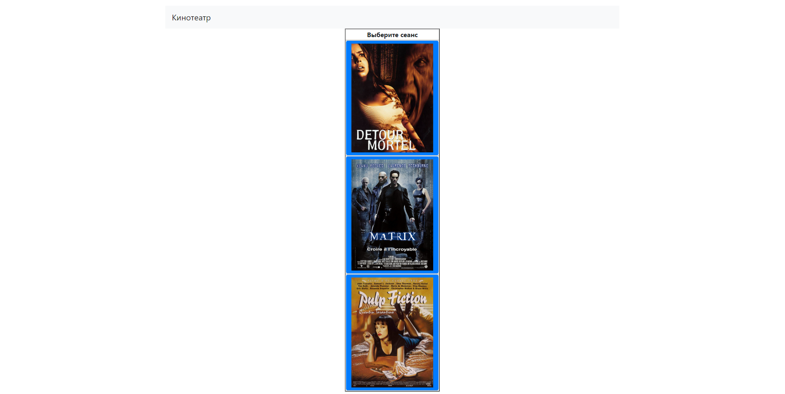
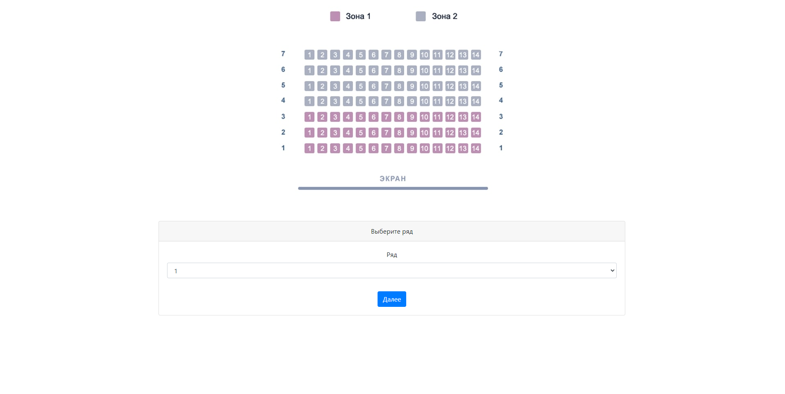
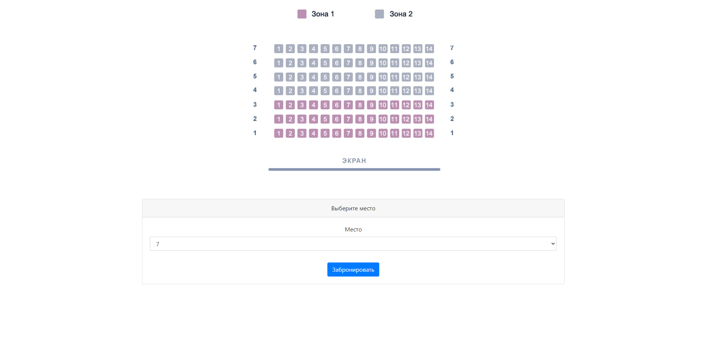
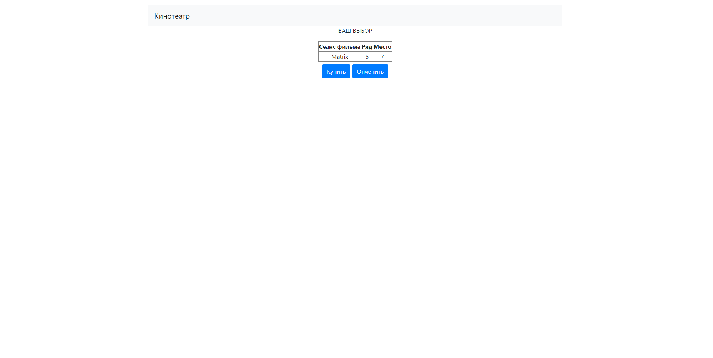
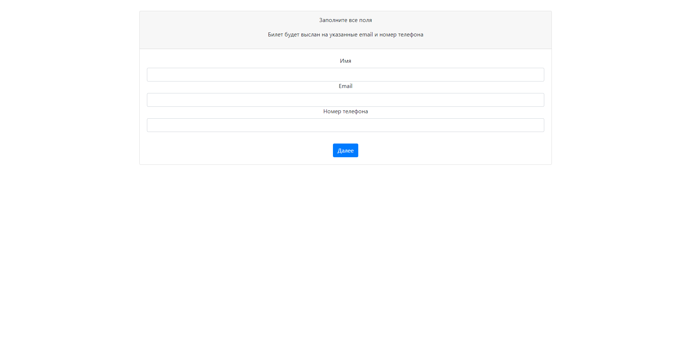
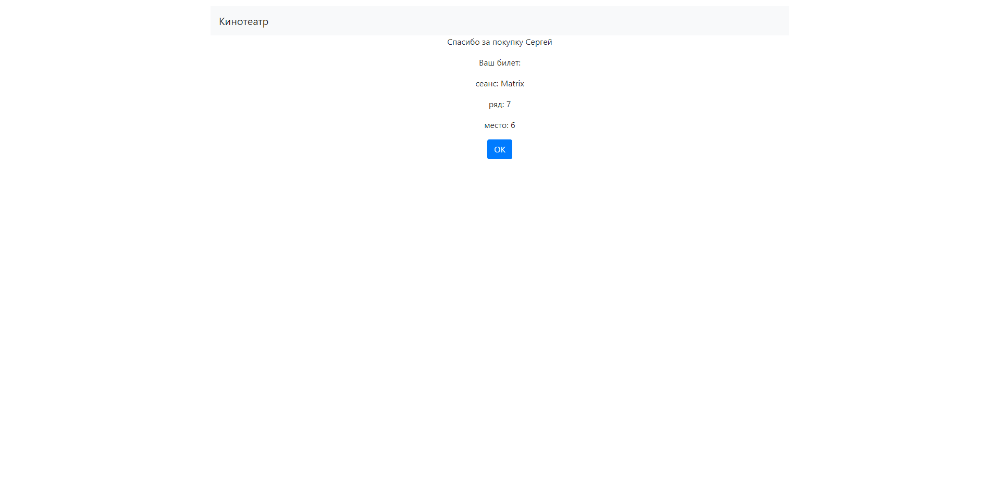

# Проект "Кинотеатр"

## Задачи

1. Создание web-приложения на языке Java;
2. Создание структуры web-приложения на основе полученных ранее знаний и опыте.

## Описание приложения

В системе используются три модели: Пользователи, Сеансы, Билеты.

Пользователю предоставляется возможность выбрать желаемый сеанс, ряд и место в зале кинотеатра.

В случае если желаемое место на сеансе уже занято, пользователю предоставляется возможность выбрать другое место.

## Используемый стек технологий

1. Java 17
2. Spring boot 2.5.2
3. Thymeleaf
4. Spring JDBC 5.3.23 
5. Liquibase 4.15.0
6. PostgreSQL 14

## Для запуска проекта понадобятся

1. JDK 17
2. Apache Maven 3.8.5
3. PostgreSQL 14
4. Web browser

## Запуск приложения

1. Открыть диалоговое окно комбинацией клавиш Win+R;
2. В диалоговом окне прописать cmd и нажать OK;
3. Подключиться к PostgreSQL командой ```psql --username=USER_NAME``` и ввести пароль;
4. Создать базу данных cinema командой ```create database cinema```;
5. Подключиться к базе данных командой ```\c cinema```;
6. Выйти из терминала psql командой ```\q```;
8. Перейти в корневую папку проекта;
9. Запустить приложение командой ```mvn spring-boot:run```;
10. Перейти по ссылке http://localhost:8080/cinemaSessions в браузере.

## Интерфейс сайта

### Главная страница



### Выбор ряда



### Выбор места



### Предпросмотр билета



### Заполнение информации о покупателе



### Информация о покупке


