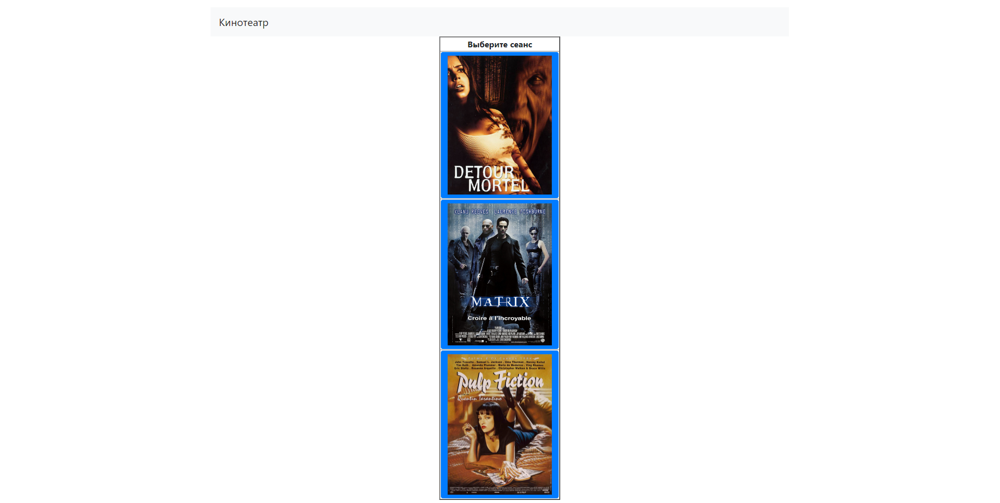
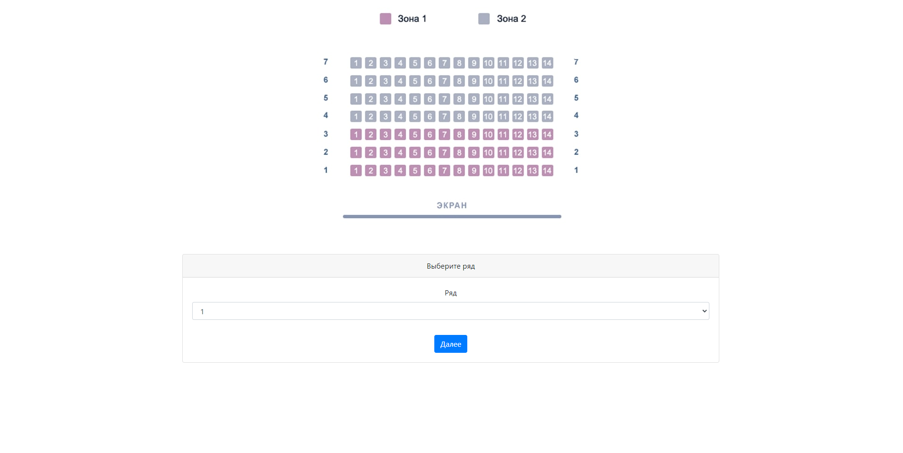
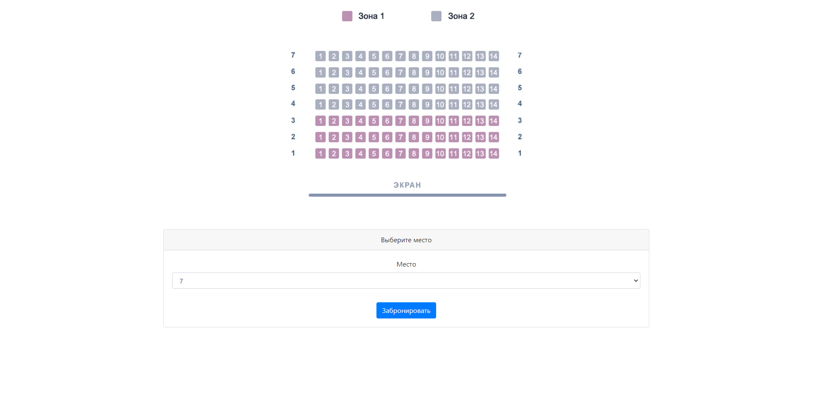
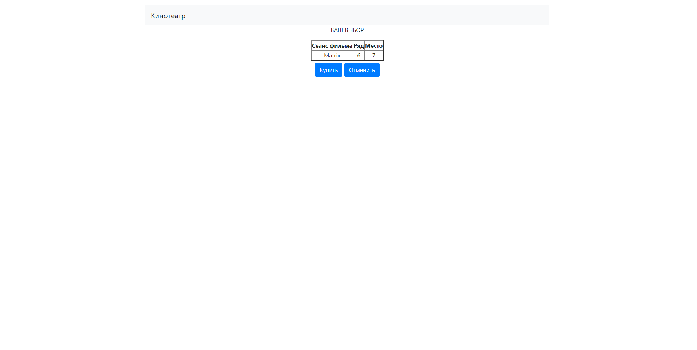
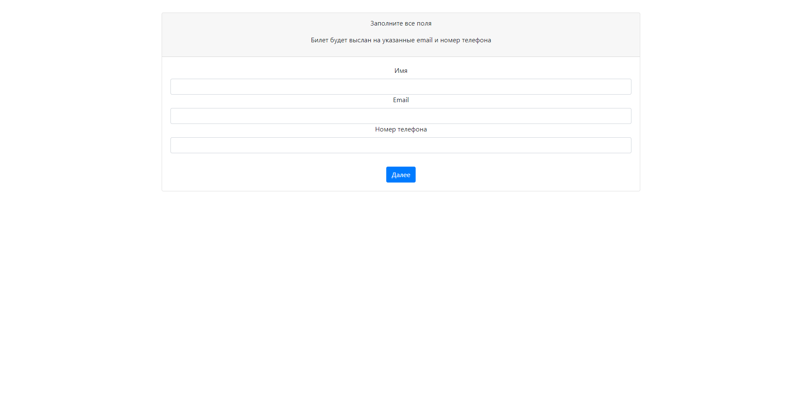
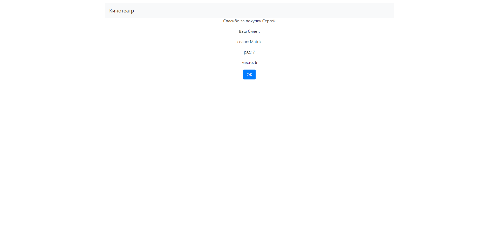

#Проект "Кинотеатр"

##Задачи

1. Создание web-приложения на языке Java;
2. Создание структуры web-приложения на основе полученных ранее знаний и опыте.

##Описание приложения

В системе используются три модели: Пользователи, Сеансы и Билеты.

Пользователю предоставляется возможность выбрать желаемый сеанс, ряд и место в зале кинотеатра.

В случае если желаемое место на сеансе уже занято, пользователю предоставляется возможность выбрать другое место.

##Используемый стек технологий

1. Spring boot
2. Thymeleaf
3. JDBC
4. Liquibase
5. PostgreSQL

##Для запуска проекта понадобятся

1. JDK 17
2. Apache Maven 3.8.5
3. PostgreSQL 14
4. Web browser

##Интерфейс сайта

###Главная страница

###Выбор ряда

###Выбор места

###Предпросмотр билета

###Заполнение информации о покупателе

###Информация о покупке

